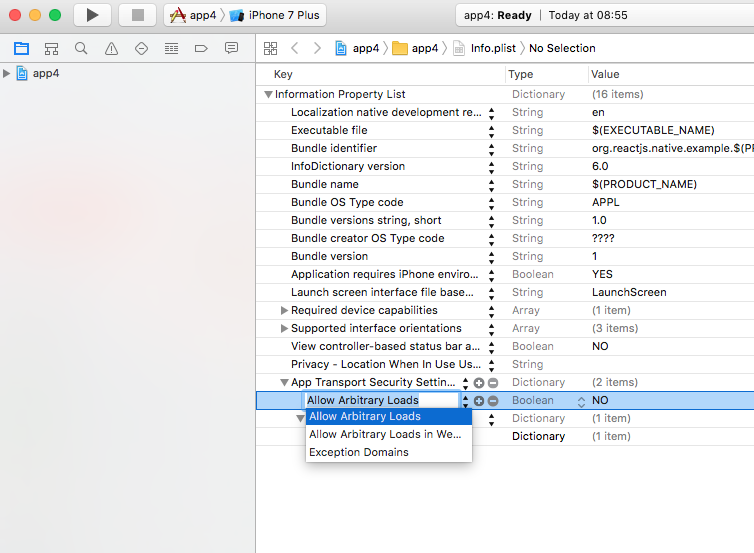
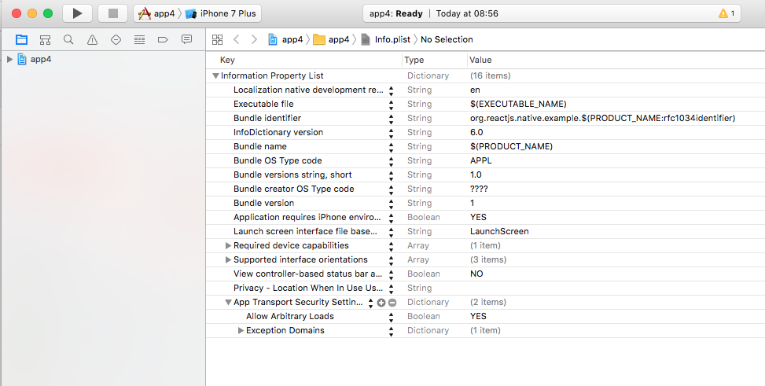

# Adicionando eslint no projeto

```
npm i --save-dev eslint-config-rallycoding
```

Sempre que for trabalhar com chamadas http primeiro você precisa libera o ios fazer conexao http e não https, pois por default o info.list permite acesso somente a serviços https.

Segundo passo com o Xcode (Recomendado):

1) Já com o arquivo aberto no Xcode, clique no botão "+" da linha com o texto "App transport security..." conforme imagem abaixo:



2) Inclua o atributo "Allow Arbitrary Loads" e defina seu valor como true, conforme imagem abaixo:


Pronto, a configuração está feita!!!


Segundo passo com um editor de texto:

Caso o arquivo seja aberto com um editor de texto adicione as seguintes linhas antes do fechamento da última tag dict:

<key>NSAppTransportSecurity</key>
<dict>
  <key>NSAllowsArbitraryLoads</key>
  <true/>
</dict>
O resultado esperado é algo parecido com:

<key>NSAppTransportSecurity</key>
 <dict>
   <key>NSAllowsArbitraryLoads</key>
   <true/>
 </dict>
</dict> // última tag dict
</plist> // fecha o plist
Pronto, a configuração está feita!!!


# StatusBar

Alterando a barra de status no android e ios utilize statusBar

# React-Native-Router-Flux

Uma forma mais facil de navegar por cenas

https://github.com/aksonov/react-native-router-flux